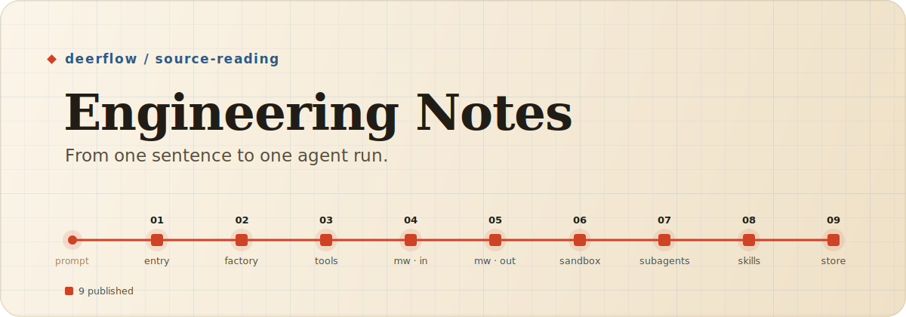

<p align="center">
  
</p>

<h1 align="center">DeerFlow Engineering Notes</h1>

<p align="center">
  Reading <a href="https://github.com/bytedance/deer-flow">DeerFlow</a>'s Python agent runtime the way you'd actually trace it —
  following one real request from a prompt all the way to a running agent.
</p>

---

This is a guided reading map of the DeerFlow 2.0 runtime. Instead of touring folders
one by one, it follows a single real request as it becomes a **run**, enters the
lead-agent factory, is handed its tools, and keeps going through the rest of the
runtime. Every stop pairs a plain-language explanation with the exact source it came
from, pinned to a commit — so the prose and the code never quietly drift apart.

## Who this is for

If DeerFlow's codebase feels like a lot to take in and you're not sure where to start,
these notes are a way in.

## DeerFlow is the real thing

These notes are a map, not the territory. For the full picture — the actual code,
issues, and roadmap — read the project itself:

> **→ [bytedance/deer-flow](https://github.com/bytedance/deer-flow)**

DeerFlow is a genuine agent system, not a demo: gateway-owned run lifecycle and
streaming, LangGraph-compatible graph factories, dynamic tool assembly, sandboxing,
subagents, skills, and persistence. If anything here sparks your curiosity, go read the
corresponding code upstream.

## Reading path

Published so far:

1. **Request entry** — how a prompt becomes a run.
2. **Lead-agent factory** — how runtime options become a compiled graph.
3. **Tool assembly** — why the tool list is *computed*, not merely registered.

Planned stops: middleware, sandboxing, subagents, skills, and persistence. Each essay
pins its source references to a DeerFlow commit, so prose and code stay in step.

## Source baseline

These notes track DeerFlow at commit
[`0fb18e36`](https://github.com/bytedance/deer-flow/commit/0fb18e36), dated **2026-06-09**.
Every essay pins its source references to that commit, so the prose matches the code
exactly as of that date. DeerFlow keeps moving, so some explanations will drift out of
date as the upstream code changes — when that happens, the notes get revised and
re-pinned to a newer commit. This baseline is the anchor that makes those updates
trackable.

## Repository layout

```text
site/      Astro + MDX blog (the canonical public version)
notes/     raw source-reading notes, kept for traceability
assets/    README artwork and repo-level visuals
```

## Status & contributing

These are personal study notes, kept public so others can read along — not a product,
and not collecting feature requests of their own.

- Want to improve the actual system? Contribute upstream to **[bytedance/deer-flow](https://github.com/bytedance/deer-flow)** — that's where the code, the issues, and the impact live.
- Spotted a wrong explanation, an awkward translation, or a broken source anchor *here*? An issue is genuinely welcome.
